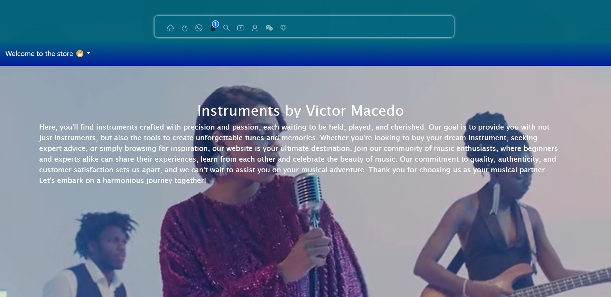
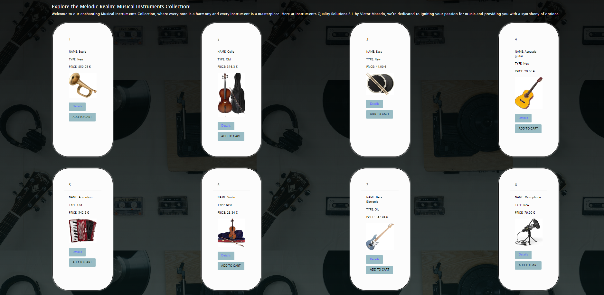
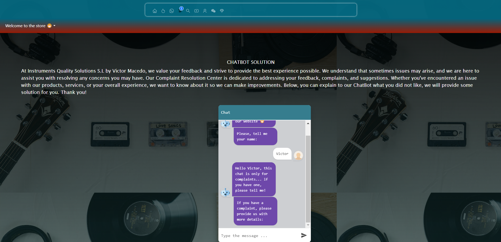

 <h1 align="center"> 1nd React Project - E-commerce </h1>

 <h3 align="center"> ⚙️ MERN STACK FRONTEND PROJECT ⚙️</h3>

  <p align="center">
    E-commerce made using Javascript and React with Context and SASS.
    <br />
    <a href="https://github.com/victorcodigos/front-end-react"><strong>Explore the docs »</strong></a>
    <br />
    ·
    <a href="https://github.com/victorcodigos/front-end-react/issues">Report Bug</a>
    ·
    <a href="https://github.com/victorcodigos/front-end-react/issues">Request Feature</a>
  </p>
</div>

<!-- PREVIEW -->
## Preview 🧑‍💻

- Home general overview

<h1>
   </img>
  
  </h1> 

<!-- TABLE OF CONTENTS -->
<details>
  <summary>Table of Contents</summary>
  <ol>
        <li><a href="#objectives">Objectives</a></li>
    <li>
      <a href="#about-the-project">About The Project</a>
      <ul>
        <li><a href="#endpoints">Endpoints</a></li>
         <li><a href="#built-with">Built With</a></li>
      </ul>   
    </li>
    <li>
      <a href="#getting-started">Getting Started</a>
      <ul>
        <li><a href="#prerequisites">Prerequisites</a></li>
        <li><a href="#installation">Installation</a></li>
      </ul>
    </li>
    <li><a href="#future-roadmap">Future Roadmap</a></li>
    <li><a href="#contributing">Contributing</a></li>
    <li><a href="#license">License</a></li>
    <li><a href="#contact">Contact</a></li>
  </ol>
</details>

<!-- ABOUT THE OBJECTIVES -->
## Objectives 💥
### Development of an e-commerce where users will:
<objectives>
  <ol>
    <li>Register</li>
    <li>Log in</a></li>
    <li>View products</a></li>
    <li>Create orders</a></li>
    <li>Add to cart</a></li>
</ol>
</objectives>


<!-- ABOUT THE PROJECT -->
## About The Project 🔎

In this project, an e-commerce is developed where users will register, log in, see products and create orders using the E-commerce API created in the 1st Backend Project <a href="https://github.com/victorcodigos/react-front-end"></a>


### Views

<views>
 
  <ol>
    <li>Home</a></li>
    <li>About us</a></li>
    <li>Audio</a></li>
    <li>Cart</a></li>
    <li>ChatBot</a></li>
    <li>Contact</a></li>
    <li>Search</a></li>
    <li>Register</a></li>
    <li>Login</a></li>
    <li>Cart</a></li>
    <li>Products</a></li>
    <li>Payments</a></li>
    <li>Profile (with Product)</a></li>
    <li>Log out</a></li>
  </ol>
</views>


<p align="right">(<a href="#readme-top">back to top</a>)</p>


### Built With
 <p align="left">


 
 

 </p>


<p align="right">(<a href="#readme-top">back to top</a>)</p>


<!-- GETTING STARTED -->
## Getting Started 😊

This is an example of how you may give instructions on setting up your project locally.
To get a local copy up and running follow these simple example steps.

### Prerequisites 🔢

This is an example of how to list things you need to use the software and how to install them.
* npm
  ```sh
  npm install react sass
  ```

### Installation 🚀

_Below is an example of how you can instruct your audience on installing and setting up your app.

1. Clone the repo
   ```sh
   git clone https://github.com/victorcodigos/front-end-react
   ```
3. Install NPM packages
   ```sh
   npm install react sass
   ```
4. Ready to start!
  ```sh
  npm start
  ```


<p align="right">(<a href="#readme-top">back to top</a>)</p>


<!-- FUTURE -->
## Future Roadmap 📍

- [ ] Add a different style
- [ ] Add more products
- [ ] Add reviews


<p align="right">(<a href="#readme-top">back to top</a>)</p>

<!-- PRODUCTS -->
## Products

<h1>
   </img>
  
  </h1>


<!-- CONTRIBUTING -->
## Contributing 😊

Contributions are what make the open source community such an amazing place to learn, inspire, and create. Any contributions you make are **greatly appreciated**.

If you have a suggestion that would make this better, please fork the repo and create a pull request. You can also simply open an issue with the tag "enhancement".
Don't forget to give the project a star! Thanks again!

1. Fork the Project
2. Create your Feature Branch (`git checkout -b feature/YourName`)
3. Commit your Changes (`git commit -m 'Add some YourName'`)
4. Push to the Branch (`git push origin feature/YourName`)
5. Open a Pull Request

<p align="right">(<a href="#readme-top">back to top</a>)</p>


<!-- LICENSE -->
## License 📲

This project is under license of Victor Macedo

<p align="right">(<a href="#readme-top">back to top</a>)</p>


<!-- CHATBOT -->
## ChatBot

<h1>
   </img>
  
  </h1>


<!-- CONTACT -->
## Contact 📩

  <p align="center">
 Victor Macedo
<a href = "victor.macedo.dedeus@gmail.com"></a>
    <a href="https://www.linkedin.com/in/victor-macedo-4a8901210/" target="_blank"></a> 
</p>


---

 Developed by [Victor Macedo](https://github.com/victorcodigos) ... Thank you :D 
